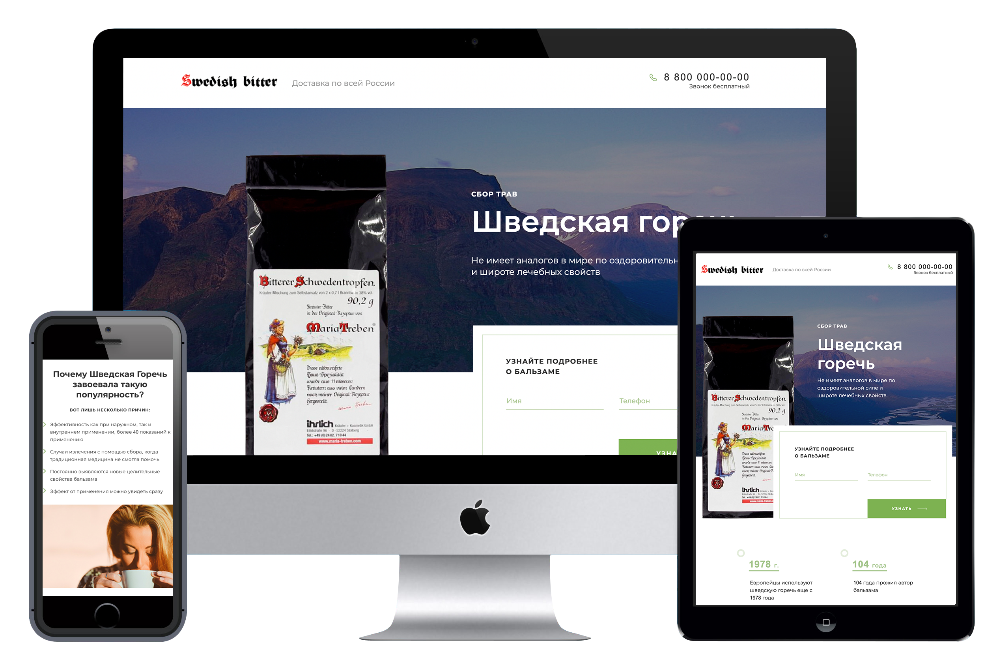

# Добро пожаловать в Swedish-Bitter 🎉

Ссылка на проект - https://egrik-dev.github.io/Swedish-Bitter


Одностраничный Landing-Page посвященный бальзаму из натуральных трав и растений с возможностью подписки на рассылку.

## Функционал проекта 💡

- Сайт сверстан адаптивно под 3 разрешения экрана (Mobile, Tablet, Desktop)
- У пользователя есть возможность подписаться на рассылку введя данные формы
- Возможность подписаться на рассылку имеется в нескольких местах на сайте и при клике на предложение появляется pop-up реализованный на JS
- В разделе про болезни при наведении на название на картинке с телом человека появляется маркер на что именно эта болезнь имеет воздействие
- В разделе про Состав средства, при наведении на картинки с растениями всплывает окошко с их названиями
- На сайте реализован раздел "Отзывы"
  - Он разделен на 2 секции "От российских потребителей" и "Зарубежных". При клике на секции отзывы меняются
  - Рендеринг отзывов происходит полностью при помощи JS. Сайт получает массив с объекатми отзывов и отрисовывает их
  - Имеется кнопка "Читать ещё" при нажатии на которую отрисовываются остывшиеся отзывы и кнопка дизеблится

## Стек технологий 🤖

- Сборка проекта осуществляется с помощью **Gulp**;
- Все сетки построены с помощью **FlexBox**;
- Использована методология **БЭМ**;
- С помощью JS реализована загрузка моковых отзывов;
- Сайт полностью работоспособен без JS.

## Установка 🛠

1. Сначала требуется склонировать проект на вашу машину

```
  git clone https://github.com/Egrik-Dev/Swedish-Bitter.git
```

2. Переходим в только что склонированный репозиторий

```
 cd Swedish-Bitter
```

3. Устанавливаем все зависимости

```
 npm i
```

4. Запускаем проект на локальном хосте

```
 npm start
```
